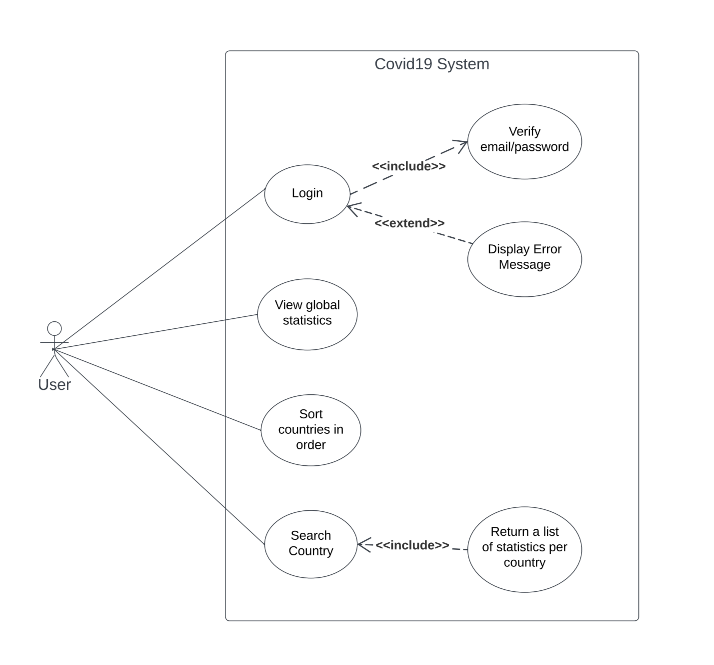

# Regov-technical

## Main Feature

- Login Module

  - Sign In
  - Sign Out

- View Global Statistics

  - Pagination
  - Sort by country Name
  - Search country Name

- View a list of statistics per country

  - Pagination
  - Sort by fields of statistical information
  - Search country Name

## Technologies

- UI / CSS Library: Tailwindcss + HeadlessUI
- State Management: React Query, React Context
- Form Management: React Hook Form
- Router: React Router
- Build tool: Vite
- Unit Test : Jest, MSW, Vitest

## Folder Structure

```shell
|--src # Main Logic Code
|   |--- apis # Setup call api for each module
|   |--- components # Share UI
|   |--- constants # constants variable
|   |--- contexts # Management global state
|   |--- hooks # Share Functions
|   |--- layouts # Setup Layouts
|   |--- mockup
|   |--- msw # Setup mock API for UT
|   |--- pages # Setup UI for each page
|   |--- types # Setup Interface for System
|   |--- utils # Setup Axios,...
|   |--- app.tsx
|   |--- main.tsx
|   |--- useRouteElement.tsx # Setup Router
|   |--- index.scss # Setup global scss
|
|-- .eslintrc.cjs # Config Eslint
|-- .prettierrc # Config prettier
|-- tsconfig.json # Config TS
|-- tsconfig.ndoe.ts # Config TS
|-- tailwind.config.cjs # Setup Tawind Config
|-- vite.config.ts # Setup vite
|-- vitest.setup.ts # Setup UT
|
```

## Set up virtual environment

```
npm install
```

## Run app

```
npm run dev
```

Runs the app in the development mode.
Open http://localhost:5173 to view it in your browser.

## Run build

```
npm run build
```

Builds the app for production to the dist folder.
It correctly bundles React in production mode and optimizes the build for the best performance.
The build is minified and the filenames include the hashes.
Your app is ready to be deployed!

## Run test

```
npm run coverage
```

## UseCase Diagram


